# IdeaHub POS System - Entity Relationship Diagram

```mermaid
erDiagram
    USERS ||--o{ DEPARTMENTS : "belongs_to"
    USERS ||--o{ IDEAS : "submits"
    USERS ||--o{ IDEA_VOTES : "votes"
    USERS ||--o{ EXPENSES : "logs"
    USERS ||--o{ STAFF_ATTENDANCE : "has"
    USERS ||--o{ STAFF_PERFORMANCE_LOGS : "generates"
    USERS ||--o{ DAILY_SALES_REPORTS : "generates"
    USERS ||--o{ SOFT_BALANCE_ENTRIES : "generates"
    USERS ||--o{ FINANCE_TRANSACTIONS : "creates"
    USERS ||--o{ ORDERS : "handles"
    USERS ||--o{ RECEIVABLES : "creates"
    USERS ||--o{ SPACE_PRICE_HISTORY : "changes"
    USERS ||--o{ INVENTORY_LOGS : "changes"

    DEPARTMENTS ||--o{ IDEAS : "receives"

    IDEAS ||--o{ IDEA_VOTES : "receives"

    SPACE_TYPES ||--o{ CUSTOMER_SESSIONS : "used_by"
    SPACE_TYPES ||--o{ RESERVATIONS : "booked_for"
    SPACE_TYPES ||--o{ SPACE_PRICE_HISTORY : "has"

    CUSTOMER_SESSIONS ||--o{ ORDERS : "creates"
    CUSTOMER_SESSIONS ||--o{ TRANSACTIONS : "generates"
    CUSTOMER_SESSIONS ||--o{ RECEIVABLES : "links_to"

    MENU_ITEMS ||--o{ ORDERS : "contains"
    MENU_ITEMS ||--o{ INVENTORY_ITEMS : "tracked_by"

    ORDERS ||--o{ ORDER_ITEMS : "contains"

    INVENTORY_ITEMS ||--o{ INVENTORY_LOGS : "has"

    FINANCE_BUDGETS ||--o{ FINANCE_TRANSACTIONS : "tracks"

    DAILY_SALES_REPORTS {
        int id PK
        date report_date UK
        decimal total_revenue
        decimal total_expenses
        decimal net_balance
        int total_orders
        int total_sessions
        int generated_by FK
        datetime generated_at
        text notes
    }

    USERS {
        int id PK
        string full_name
        string username UK
        string password
        string role
        string job_role
        datetime created_at
        int failed_login_attempts
        datetime locked_until
        datetime last_login
        datetime password_changed_at
    }

    DEPARTMENTS {
        int id PK
        string name UK
        datetime created_at
        datetime updated_at
    }

    IDEAS {
        int id PK
        string title
        text description
        string status
        int department_id FK
        int user_id FK
        datetime created_at
        datetime updated_at
    }

    IDEA_VOTES {
        int id PK
        int idea_id FK
        int user_id FK
        boolean is_upvote
        datetime created_at
        datetime updated_at
    }

    SPACE_TYPES {
        int id PK
        string name UK
        decimal rate_per_minute
        string description
        int capacity
        string qr_token UK
    }

    CUSTOMER_SESSIONS {
        int id PK
        string customer_name
        string school
        string course
        int space_type_id FK
        datetime time_in
        datetime time_out
        string status
        int number_of_people
        string payment_method
        decimal amount_tendered
    }

    TRANSACTIONS {
        int id PK
        int session_id FK
        decimal time_bill
        decimal food_bill
        decimal total_bill
        datetime created_at
        string payment_method
    }

    MENU_ITEMS {
        int id PK
        string name
        decimal price
        string category
        string status
        string image_url
        boolean is_available
        text description
        datetime created_at
        datetime updated_at
    }

    ORDERS {
        int id PK
        int customer_session_id FK
        datetime created_at
        string status
        int handled_by FK
    }

    ORDER_ITEMS {
        int id PK
        int order_id FK
        int menu_item_id FK
        int quantity
        decimal price
        string status
    }

    INVENTORY_ITEMS {
        int id PK
        int menu_item_id FK
        int stock_qty
        int low_stock_threshold
        string unit
        datetime created_at
        datetime updated_at
    }

    INVENTORY_LOGS {
        int id PK
        int inventory_item_id FK
        int change_qty
        string reason
        int changed_by FK
        datetime created_at
    }

    BOARDROOM_BOOKINGS {
        int id PK
        string customer_name
        date date
        time start_time
        time end_time
        int number_of_people
        string purpose
        string status
        datetime created_at
        int session_id
        datetime started_at
        datetime expected_end_at
        datetime ended_at
        int extended_minutes
        string course
    }

    LOUNGE_BOOKINGS {
        int id PK
        string customer_name
        date date
        time start_time
        time end_time
        int number_of_people
        string purpose
        string status
        datetime created_at
    }

    RESERVATIONS {
        int id PK
        string customer_name
        string customer_contact
        int space_type_id FK
        date reserved_date
        time reserved_time
        int duration_minutes
        int number_of_people
        string status
        text notes
        datetime created_at
    }

    EXPENSES {
        int id PK
        string category
        text description
        decimal amount
        date expense_date
        int logged_by FK
        datetime created_at
    }

    FINANCE_BUDGETS {
        int id PK
        string name
        decimal total_budget
        decimal allocated
        datetime created_at
        datetime updated_at
    }

    FINANCE_TRANSACTIONS {
        int id PK
        int budget_id FK
        string type
        decimal amount
        string description
        datetime created_at
        datetime updated_at
    }

    RECEIVABLES {
        int id PK
        string customer_name
        string customer_contact
        text items_description
        decimal amount_owed
        date due_date
        boolean paid
        decimal partial_paid
        int created_by FK
        int session_id FK
        datetime created_at
    }

    SOFT_BALANCE_ENTRIES {
        int id PK
        date balance_date
        string period
        decimal total_revenue
        decimal total_expenses
        decimal net_balance
        text notes
        int generated_by FK
        datetime generated_at
    }

    SPACE_PRICE_HISTORY {
        int id PK
        int space_type_id FK
        decimal old_price
        decimal new_price
        datetime changed_at
        int changed_by_id FK
    }

    STAFF_ATTENDANCE {
        int id PK
        int user_id FK
        datetime time_in
        datetime time_out
    }

    STAFF_PERFORMANCE_LOGS {
        int id PK
        int user_id FK
        date shift_date
        int orders_handled
        decimal avg_order_minutes
        int sessions_managed
        int upsell_count
        text admin_note
        decimal score
        datetime created_at
        int customers_served
    }
```

## Database Schema Overview

### Core Entities:
- **Users**: System users with roles (admin, staff)
- **Departments**: Organization departments
- **Space Types**: Different lounge types and boardrooms with hourly rates

### Sales & Orders:
- **Menu Items**: Available food/drink items
- **Orders**: Customer orders with status tracking
- **Order Items**: Individual items within orders
- **Transactions**: Payment records for sessions

### Customer Management:
- **Customer Sessions**: Lounge session tracking with time and space allocation
- **Boardroom Bookings**: Boardroom reservations
- **Lounge Bookings**: Lounge bookings
- **Reservations**: Space reservations

### Inventory:
- **Inventory Items**: Stock tracking for menu items
- **Inventory Logs**: Changes to inventory with reasons

### Finance:
- **Expenses**: Operating expense tracking
- **Finance Budgets**: Budget allocation
- **Finance Transactions**: Budget transactions
- **Daily Sales Reports**: Daily revenue/expense summaries
- **Soft Balance Entries**: Interim balance records
- **Receivables**: Customer receivables tracking

### Pricing & History:
- **Space Price History**: Track price changes for spaces

### Staff:
- **Staff Attendance**: Attendance logging
- **Staff Performance Logs**: Performance metrics

### Ideas & Feedback:
- **Ideas**: Employee suggestion system
- **Idea Votes**: Voting on ideas

## Key Relationships:

1. **Users** - Central entity linking to most operations
2. **Space Types** - Links customer sessions, bookings, and reservations
3. **Orders** - Links customers, menu items, and transactions
4. **Inventory** - Tracks menu item stock with change logs
5. **Finance** - Comprehensive tracking of revenue, expenses, and budgets
6. **Staff** - Attendance and performance tracking
7. **Ideas** - Employee engagement system
