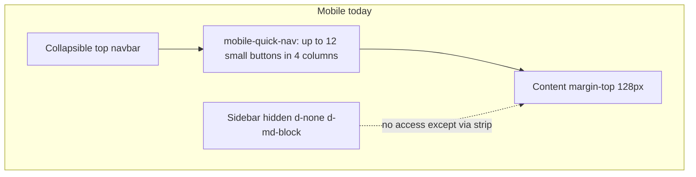
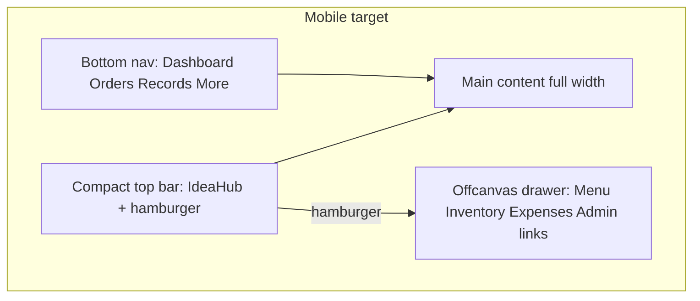

# Mobile UI/UX Optimization Plan

## Current state (why mobile feels confusing)

You already have a viewport meta tag and some Bootstrap breakpoints, but mobile is **desktop layout squeezed**, not a phone-first experience:

| Issue | Where | Impact |
|-------|--------|--------|
| **Two nav layers** | [`layout.html`](app/templates/layout.html) L199–217 + navbar | Crowded strip; admin sees Balance/Analytics as tiny buttons |
| **Sidebar hidden, not replaced** | Sidebar `d-none d-md-block` | No structured “all pages” menu on phone |
| **Dashboard = wide table** | [`dashboard.html`](app/templates/dashboard.html) | Only 4 columns on phone; actions are small row buttons |
| **Order page = long scroll** | [`order.html`](app/templates/order.html) L395–410 | Menu stacks above full-width cart; hard to see cart while ordering |
| **Records = table** | [`checkout_records.html`](app/templates/checkout_records.html) | Many columns hidden; still not scannable |
| **Fixed toast width** | [`layout.html`](app/templates/layout.html) L34–38 | 330px toasts can clip on narrow screens |

Desktop (`md+`) stays as-is: fixed sidebar + content offset in [`static/css/style.css`](static/css/style.css).

---

## Target mobile experience

**Bottom bar (daily staff tasks):** Dashboard · Orders · Records · More  
**More** opens offcanvas with: Booking, Menu, Inventory, Expenses, Receivables (+ admin-only: Daily Balance, Analytics, Admin Panel, etc.)  
**Hamburger** (top-right): same drawer or merged single “Menu” drawer—implement **one** offcanvas component to avoid duplication.

User choice: **bottom bar + hamburger** — use bottom bar for the 4 core actions; hamburger opens full site map (including admin links).

---

## Phase M1 — Mobile shell (layout + CSS foundation)

**Files:** [`app/templates/layout.html`](app/templates/layout.html), [`static/css/style.css`](static/css/style.css)

1. **Remove** the overloaded `mobile-quick-nav` 4-column grid (L199–217); replace with:
   - Slim top bar: brand + optional orders badge + **hamburger** (`data-bs-offcanvas`)
   - **Fixed bottom nav** (`position: fixed; bottom: 0; safe-area-inset-bottom`) with 4 items and icons (`bi-grid`, `bi-bag`, `bi-receipt`, `bi-three-dots` for More)
   - **Bootstrap offcanvas** (`offcanvas-end`) listing all links currently in sidebar (role-aware: `admin` vs `staff`), grouped like existing sections (Navigation, Spaces, Operations, Finance, Staff)

2. **Adjust mobile content area** in `style.css`:
   - `margin-left: 0`; `padding-bottom: ~80px` for bottom nav; `margin-top` = top bar only (~56px, not 128px)
   - Hide desktop sidebar remains `d-none d-md-block`
   - Collapse top navbar’s duplicate link list on mobile (`d-none d-md-flex` for desktop links only)

3. **Touch targets:** min 44px height on bottom nav and drawer rows (already on `.btn` in CSS L122)

4. **Toasts:** `@media (max-width: 767.98px)` — `width: calc(100vw - 32px); max-width: 100%`

**Preserve:** All URLs, auth, CSRF, socket scripts in layout unchanged.

---

## Phase M2 — Dashboard (highest staff traffic)

**File:** [`app/templates/dashboard.html`](app/templates/dashboard.html) + small CSS in `style.css` or scoped block

1. **Dual render in `loadSessions()`:**
   - `md+`: keep existing `<table>` rows
   - `< md`: append **session cards** into a new `#sessions-cards` container (hide table with `d-none d-md-block` / show cards with `d-md-none`)

2. **Each card shows:** name, space badge, time in, **duration + bill** (data currently hidden on mobile), two full-width stacked buttons: **Add Order** | **View / Checkout**

3. **Header row:** stack title + search full-width on mobile (`flex-column flex-md-row`)

4. **Space availability:** two cards already in row; use `col-12` on xs (already `col-md-6`)

5. **FAB (+ check-in):** raise `bottom` to `calc(80px + env(safe-area-inset-bottom))` so it sits above bottom nav

---

## Phase M3 — Order page (menu + cart)

**File:** [`app/templates/order.html`](app/templates/order.html)

Replace “menu block then cart block” mobile stack with **tabbed or segmented control:**

- **Tab 1: Menu** — existing grid (keep `minmax(150px, 1fr)` or 2 columns on very small screens)
- **Tab 2: Cart** — cart sidebar content only; sticky **Place order** footer inside tab

Optional enhancement: floating **Cart (n)** pill on Menu tab when items pending.

**Preserve:** All existing `csrfFetch` / add-order API calls; only DOM structure and mobile CSS.

---

## Phase M4 — Checkout Records + owner-friendly summaries

**File:** [`app/templates/checkout_records.html`](app/templates/checkout_records.html)

1. Summary cards (Cash/GCash/total): already exist; ensure `col-12` on mobile for vertical stack

2. **Mobile list:** card per checkout (customer, date, total, payment badge, tap to expand line items) — mirror desktop table data from existing JS `renderRecords()`

3. Filters (date, payment): stack vertically; full-width selects

**Owner use case:** quick Cash vs GCash check on phone without horizontal scroll.

---

## Phase M5 — Secondary pages (lighter pass)

| Page | Change |
|------|--------|
| [`admin/menu.html`](app/templates/admin/menu.html) | Verify 2-column grid on `sm`; larger tap targets on card actions |
| [`admin/inventory.html`](app/templates/admin/inventory.html) | Same |
| [`admin/daily_balance.html`](app/templates/admin/daily_balance.html) | Export buttons: `d-grid gap-2` on mobile; summary cards full width |
| [`admin.html`](app/templates/admin.html) | Defer deep mobile redesign; reachable via drawer |
| Login / landing | [`auth_layout.html`](app/templates/auth_layout.html) + `.login-card { width: 100%; max-width: 390px }` on mobile |

**No backend changes** in Phases M1–M5.

---

## Testing checklist (real phone or Chrome DevTools)

1. iPhone SE width (375px) and a larger phone (414px)
2. Staff flow: Login → Dashboard card → Add Order → tabs → checkout Cash/GCash
3. Bottom nav highlights active page; hamburger shows all admin links for admin user
4. No content hidden behind bottom nav or FAB
5. Desktop `>= 768px`: sidebar + table layouts unchanged

---

## Scope boundaries (intentionally not in v1)

- No separate native app or PWA install prompt (can add later)
- No redesign of Analytics charts / Admin panel tables (drawer access only)
- No API or database changes

---

## Suggested execution order

| Step | Effort | User-visible win |
|------|--------|------------------|
| M1 Shell | Medium | Navigation no longer confusing |
| M2 Dashboard | Medium | Core staff workflow works on phone |
| M3 Order | Medium–High | Ordering without endless scroll |
| M4 Records | Medium | Owner audit on phone |
| M5 Polish | Low | Remaining pages usable |

Stop after each phase for your approval (per your production workflow).
