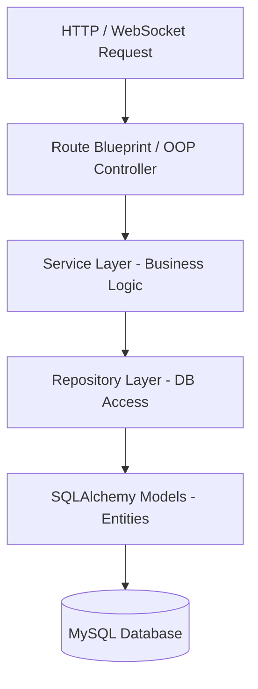

# 🛠 IdeaHub POS & Workspace Tracker — Technical Architecture Guide

This document provides an in-depth technical reference for software engineers, systems architects, and technical maintainers working on the **IdeaHub** codebase.

---

## 1. System Technology Stack

IdeaHub is designed as a modular, monolithic web application with clear architectural boundaries.

| Layer | Technology | Technical Details |
| :--- | :--- | :--- |
| **Runtime Environment** | Python 3.12+ | Interpreted object-oriented core |
| **Web Framework** | Flask 3.x | WSGI web application framework |
| **ORM & Database** | Flask-SQLAlchemy (SQLAlchemy 2.x) | ORM mapping with PyMySQL driver for MySQL 8.0+ |
| **Real-Time Layer** | Flask-SocketIO | Event-driven WebSocket & long-polling communication |
| **Security Suite** | Bcrypt, Flask-WTF, Flask-Limiter | Salting/hashing, CSRF header defense, rate limiting |
| **Document Processing**| WeasyPrint, xhtml2pdf, OpenPyXL | Server-side PDF rendering and Excel report generation |
| **Frontend Stack** | Jinja2, Vanilla ES6+, Bootstrap 5, Chart.js | SSR with interactive client-side rendering |

---

## 2. Software Architecture & Layering Model

The application strictly enforces a **Repository-Service-Controller** architectural pattern to decouple business logic from web transport and database persistence.



### Layer Responsibilities
- **Controllers & Routes (`app/controllers/`, `app/routes/`)**: Responsible for HTTP request parsing, input parameter extraction, role authorization guards (`@admin_required`, `@login_required`), and returning structured JSON (`api_response.py`) or rendered Jinja2 templates.
- **Service Layer (`app/services/`)**: Contains pure business rules, validation logic, calculation algorithms (e.g. dynamic session pricing, balance calculations), and document generation calls.
- **Repository Layer (`app/repositories/`)**: Encapsulates all SQLAlchemy query operations (`db.session.query()`, joins, filtering, aggregations). Prevents raw SQL queries from leaking into business logic.
- **Model Layer (`app/models/`)**: Defines database table structures, column types, relationships, and entity methods (e.g. `check_password()`, `is_locked()`).

---

## 3. Modular Blueprint Registration

Blueprints in `app/__init__.py` are organized logically into functional domain modules:

1. **Authentication & User Management Module**
   - `auth_routes.py` (`/api/login`, `/logout`)
   - `user_routes.py` (`/dashboard`, `/profile`)
   - `admin_routes.py` (`/admin/*`)
   - `ManagementController` (`/management/*`, `/api/management/*`)

2. **POS Operations & Space Management Module**
   - `dashboard_routes.py` (`/dashboard/*`, `/api/checkin`)
   - `session_routes.py` (`/api/sessions/*`)
   - `order_routes.py` (`/api/add-order`, `/api/void-item/*`)
   - `lounge_routes.py` (`/lounge/*`)
   - `boardroom_routes.py` (`/boardroom/*`, `/api/book-boardroom`)
   - `receipts_bp` (`/receipt/*`)

3. **Catalog & Inventory Module**
   - `menu.py` (`/admin/menu/*`)
   - `inventory.py` (`/admin/inventory/*`)
   - `staff_menu.py` (`/menu-view/*`)
   - `staff_inventory.py` (`/inventory/*`)

4. **Financial, Accounting & Analytics Module**
   - `sales_routes.py` (`/api/daily-sales`, `/api/sales-summary`)
   - `sales_balance.py` (`/admin/daily-balance/*`)
   - `expenses.py` (`/admin/expenses/*`)
   - `staff_expenses.py` (`/expenses-view/*`)
   - `receivables.py` (`/admin/receivables/*`)
   - `payables.py` (`/admin/payables/*`)
   - `staff_performance.py` (`/admin/staff-performance/*`)
   - `analytics.py` & `AnalyticsController` (`/analytics`, `/api/analytics/*`)
   - `FinanceController` (`/finance`, `/api/finance/*`)

---

## 4. Security Infrastructure & Data Pipeline

### Password Hashing & Account Lockout
- **Bcrypt Hashing**: Passwords are hashed using `bcrypt.hashpw(password.encode('utf-8'), bcrypt.gensalt())`.
- **Brute-Force Protection**: Tracked via `failed_login_attempts` and `locked_until` columns in the `users` table. Upon reaching 5 failed attempts (`MAX_LOGIN_ATTEMPTS`), the account locks for 15 minutes (`LOCKOUT_DURATION = 900`).

### Session Hygiene
- `SESSION_COOKIE_HTTPONLY = True` prevents JavaScript cookie access.
- `SESSION_COOKIE_SAMESITE = 'Lax'` mitigates cross-site request forgery.
- `PERMANENT_SESSION_LIFETIME = 7200` (2 hours) automatically invalidates inactive sessions.

### Input Sanitization & XSS Defense
- **Server-Side**: String inputs are sanitized via `sanitize_input()` in `app/utils/auth.py` to strip/escape dangerous HTML tags.
- **Client-Side**: Global JavaScript helper `window.escapeHTML(str)` in `layout.html` sanitizes dynamic strings inserted via DOM manipulation (`innerHTML`).

### File Upload Pipeline (`app/utils/uploads.py`)
Uploads pass through a multi-stage security verification process:
1. **Extension Check**: Verifies file extension against allowed extensions (`.png`, `.jpg`, `.jpeg`, `.gif`, `.webp`).
2. **Size Enforcement**: Rejects payloads larger than 5MB (`UPLOAD_MAX_FILE_SIZE`).
3. **Magic Byte Verification**: Inspects the first 16 bytes of the binary header to confirm genuine image format signatures (e.g. `\x89PNG\r\n\x1a\n` for PNG).
4. **Filename Anonymization**: Generates a random UUID filename (`menu_<uuid>.ext`) using `secure_filename()` to eliminate path traversal vulnerabilities.
5. **Image Optimization**: Utilizes Pillow (`PIL`) to convert RGBA images to RGB, downscale dimensions exceeding 1200px width, and save with quality compression (`quality=85`).

---

## 5. Real-Time WebSockets Synchronization

Real-time events are coordinated through `app/core/socketio_handlers.py` using `flask_socketio.emit`.

Key WebSocket Event Channels:
- `menu_update`: Emitted when item prices, availability, or categories change.
- `inventory_update`: Emitted during stock updates or ingredient consumption.
- `staff_status_change`: Emitted when staff members log in or log out (online/offline state).

---

## 6. Diagnostics & Diagnostic Testing

Pre-production integrity is validated using custom automated diagnostics scripts:

```bash
python scripts/validate_imports.py
```
This script validates:
- Import integrity of all SQLAlchemy models in `app/models/`.
- Repositories initialization in `app/repositories/`.
- Service layer instantiation in `app/services/`.
- Full Flask application context creation and route blueprint verification.

---
*Technical Documentation Version 2.0*
